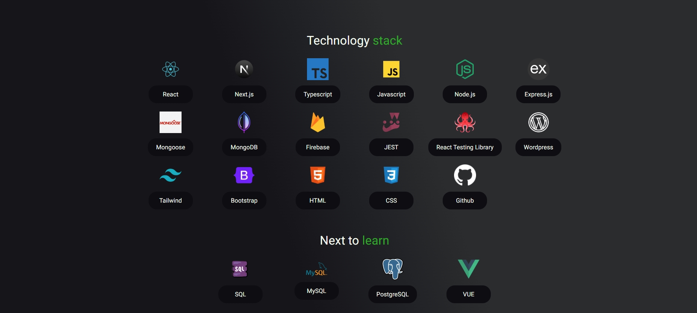

<h1>Portfolio page</h1>

Welcome! This is my portfolio page, built with Next.js, TypeScript, and Tailwind CSS for styling. The site is fully responsive across all devices and follows top SEO practices. It’s a straightforward app featuring sub-pages like About Me, Contact, and Projects, plus dynamic pages for individual projects I’ve created. You can explore details about me, my contact info, the technologies I use, and even download my resume directly from the site. The Projects section showcases my work with links to GitHub repositories, live demos, and deeper insights into each one. Plus, I’ve written over 100 unit tests of varying complexity using Jest and RTL to ensure most components work flawlessly.

Check out the live demo hosted on Vercel: <a href='https://tomaszzportfolio.vercel.app/'>Portfolio</a>

<h2>📫 Project contains</h2>

- Main pages with basic info about me
- Three sub-pages: About Me, Projects, and Contact
- Dynamic pages featuring individual projects and their details
- Fully functional contact form sending emails via Vercel and Formspree
- Over 100 unit tests written with Jest and RTL for most components
- Axios integration for form submission to my email
- Framer Motion for site animations
- Fully responsive design
- Accessibility-friendly practices
- SEO-optimized structure
- Custom "Not Found" page

<h2>🛠 Used tools / programming languages / technologies</h2>

- React,
- Next.js,
- Typescript,
- Tailwind,
- JEST / React Testing Library
- Axios / Vercel / Formspree,
- Framer Motion,
- Git / Github,
- Responsive / SEO

 
 
 
 

