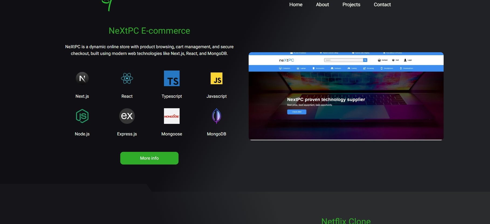

<h1>Portfolio page</h1>

Hello, I present to you my portfolio page. The application is made in Next.js, written in Typescript and using Tailwind for styling - page is fully responsive and with best SEO practices. It's a simple site with several sub-pages (about me, contact and projects), as well as dynamic pages for single created project. On the site you can read some information about me, how to contact me, what technologies I work in, and also download my resume. In addition, on the projects sub-page there are projects created by me, as well as the opportunity to read more information about them, a link to github and live version. Also more than 100 unit tests of varying complexity have been written for the website using JEST and RTL to check the correct behaviour of most components.

I encourage you to check the website - uploaded to vercel <a href='https://tomaszzportfolio.vercel.app/'>Portfolio</a>

<h2>📫 Project contains</h2>

- main pages with some basic informations about me,
- three sub-pages - about me, projects and contact,
- dynamic pages contains single projects and data about them,
- a fully functioning form where you can send me direct email if you want to contact me (uses a form provided by Vercel and Formspree),
- site is tested using JEST and RTL - more than 100 unit tests are witten for most components
- also using Axios to send form to my email,
- framer motion package used to animate site,
- project is fully responsive,
- accessibility practices,
- SEO practices,
- custom not found page,

<h2>🛠 Used tools / programming languages / technologies</h2>

- React,
- Next.js,
- Typescript,
- Tailwind,
- JEST / React Testing Library
- Axios / Vercel / Formspree,
- Framer Motion,
- Git / Github,
- Responsive / SEO

 
 
 
 

